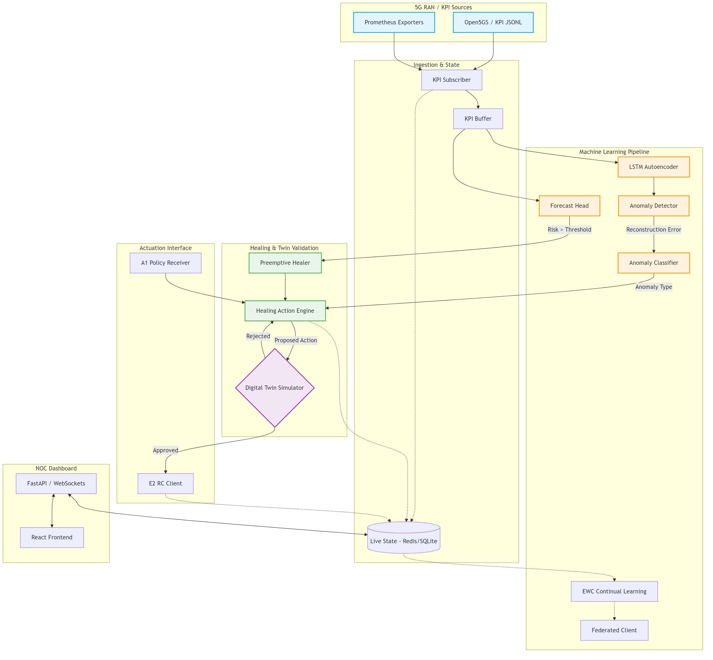

# ASTRA: Autonomous 5G RAN Self-Healing xApp
## High-Level Architecture

ASTRA is an O-RAN style xApp prototype that brings advanced machine learning and autonomous self-healing capabilities to 5G Radio Access Networks. 

### Architecture Diagram

### Key Components

1. **KPI Ingestion Pipeline:** 
   - Normalizes telecom metrics from disparate sources (Prometheus, Open5GS logs).
   - Buffers sequential data for ML inference.

2. **ML Core:**
   - **LSTM Autoencoder:** Encodes the state sequence and detects anomalies based on reconstruction error (MSE).
   - **Anomaly Classifier:** Attributes the error to specific KPIs (e.g., Congestion vs. Interference vs. Hardware Fault).
   - **Forecast Head:** Predicts future KPI values to enable preemptive healing before SLA violation.

3. **Digital Twin & Healing:**
   - **Action Engine:** Maps classified anomalies to proposed RAN configuration changes (e.g., Admission Control, Handover thresholds).
   - **Digital Twin Simulator:** Evaluates the proposed action. The action is only dispatched if the twin predicts a positive KPI impact (Risk < Threshold).
   - **E2 RC Client:** Responsible for sending the approved control actions to the RAN base stations via E2 interface.

4. **Dashboard:**
   - A React-based NOC (Network Operations Center) providing real-time telemetry, model confidence, and healing logs over WebSockets.
