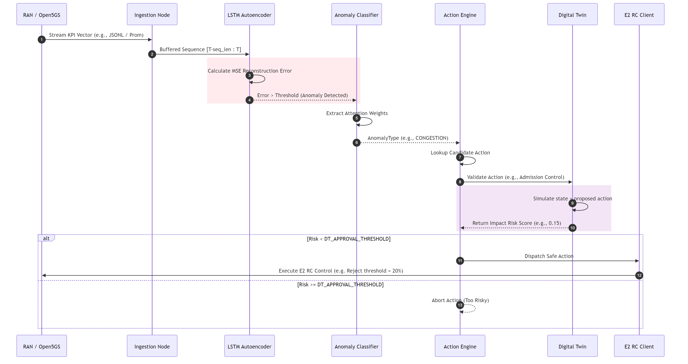
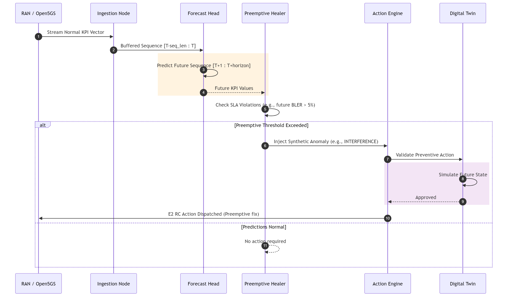

# ASTRA Sequence and Data Flows

This document details the exact sequence of operations for both Reactive and Preemptive Healing workflows in ASTRA.

## 1. Reactive Healing Data Flow

This flow occurs when an actual anomaly (e.g., cell congestion) is detected in the live incoming telemetry.

## 2. Preemptive Healing Data Flow

This flow occurs when the current state is normal, but the forecasting model predicts an upcoming SLA violation.

## 3. Persistent State and Continual Learning

Throughout these sequences, telemetry, anomalies, and applied actions are saved to `ASTRA_EVENT_DB` (SQLite/Redis) via `xapp.state.LiveState`. This state repository is consumed offline by the EWC (Elastic Weight Consolidation) engine to retrain the models without catastrophic forgetting.
